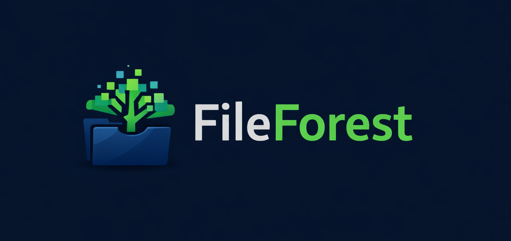

# FileForest Web Application

A full‑stack **File Hosting / File Manager Web App** that allows users to upload, download, delete, rename, and manage files and folders with **real‑time updates**. The project is designed to work with personal or server‑side storage and supports modern authentication and session management.



---

## 🚀 Features

- 📤 Upload files (single & multiple)
- 📊 Upload progress bar (per file)
- 📥 Download files
- ✏️ Rename files & folders
- 🗑️ Delete files & folders
- 🔄 Real-time file updates using Socket.IO
- 🔍 File search & sorting
- 👤 User authentication (JWT based)
- 🔐 Session & device management
- 📡 Real-time auto logout across devices
- 📈 Dashboard with storage usage
- 📱 Fully mobile responsive UI
- 👁️ Built-in file preview (images, PDFs, videos, text files)

---

## 🛠️ Tech Stack

### Frontend

- React.js
- Tailwind CSS
- Axios
- Zustand (State Management)
- React Router DOM
- Socket.IO Client
- Framer Motion

### Backend

- Node.js
- Express.js
- MongoDB
- Mongoose
- Multer (File Uploads)
- Socket.IO
- JWT Authentication
- Cookie‑Parser
- Chokidar (File watcher)

---

## 📁 Project Structure

```
file-hosting-app/
│
├── backend/
│   ├── config/
│   ├── controllers/
│   ├── mailtrap/
│   ├── middleware/
│   ├── models/
│   ├── routes/
│   ├── utils/
│   ├── .env
│   └── index.js
│
├── frontend/
│   ├── src/
│   │   ├── assets/
│   │   ├── components/
│   │   ├── pages/
│   │   ├── store/
│   │   ├── ui/
│   │   ├── utils/
│   │   └── App.jsx
│   └── main.jsx
│
└── README.md
```

---

## ⚙️ Installation & Setup

### 1️⃣ Clone the Repository

```bash
git clone https://github.com/dipanshu0104/fileForest.git
cd fileForest
```

---

### 2️⃣ Backend Setup

```bash
cd backend
npm install
```

Create a `.env` file:

```env
PORT=Port_of_app
MONGO_URL=Your_Mongodb_url
JWT_SECRET=your_jwt_secret

LISTEN_FOLDER=your_listen_folder

GMAIL_USER=your_mail
GMAIL_PASS=Your_password

CLIENT_URL=client_url

```

---

### 3️⃣ Frontend Setup

```bash
cd frontend
npm install
```

Create a `.env` file:

```bash
VITE_API_BASE=/api
VITE_FILE_API_BASE=/api/file
VITE_SOCKET_PATH=/socket.io
```

When everything is setup then go to the main folder of fileForest and Run command:

```bash
npm run dev
```

---

## 🔄 Real‑Time Functionality

This project uses **Socket.IO** to sync file operations across all connected clients:

- Upload
- Delete
- Rename
- Folder creation
- Session logout

No page refresh required 🚀

---

## 🔐 Authentication Flow

1. User logs in
2. JWT is stored in HTTP‑only cookies
3. Sessions are tracked per device
4. Remote logout supported
5. Auto logout triggered in real‑time

---

## 📸 Screenshots

<video
  src="frontend/public/fileforest.mp4" title="Title"
  autoPlay
  loop
  muted
  playsInline
  className="rounded-xl">
</video>

---

---

## 🧠 Future Improvements

- 🔐 Role‑based access control
- ☁️ Cloud storage integration (S3, GDrive)
- 🧾 Activity logs
<!-- - 📱 Mobile responsive UI
- 🧩 File preview support -->

---

## 🤝 Contributing

Contributions are welcome!

1. Fork the repo
2. Create a new branch
3. Commit changes
4. Open a pull request

---

## 📄 License

This project is licensed under the **MIT License**.

---

## 👨‍💻 Author

**Dipanshu Kumar**  
GitHub: https://github.com/dipanshu0104

---

⭐ If you like this project, don’t forget to star the repository!
